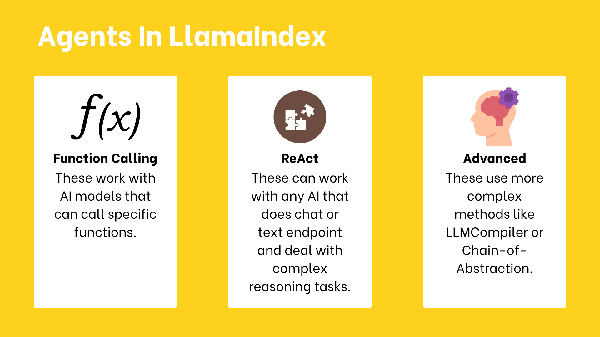
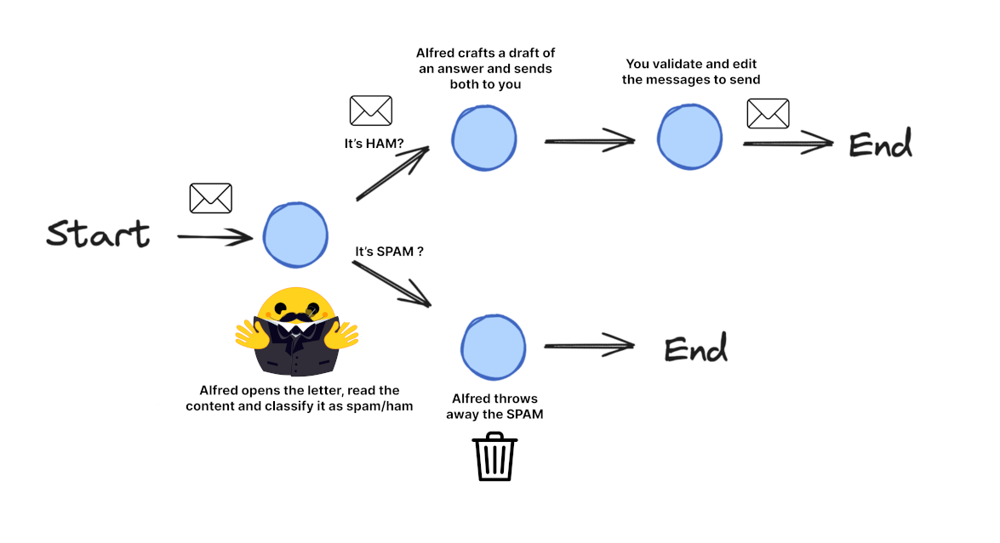

# Learning LLM Agents


## WHAT IS AN AGENT?

_Agent_ - is an AI model capable of reasoning, planning, and interacting with its environment. More officially:
> "An Agent is a system that leverages an AI model to interact with its environment in order to achieve a user-defined objective. It combines reasoning, planning, and the execution of actions (often via external tools) to fulfill tasks."

_Agency_ - the ability to interact with the environment.

_Brain (AI Model)_ - this is where all the thinking happens. The AI model handles reasoning and planning. Decides on actions to take. 

_Body (Capabilities and Tools)_ - this is everything the agent is equipped to do.

Agency levels:


The most common AI model found in agents is an LLM, which takes Text as an input and outputs Text as well.

## WHAT ARE LLMs?

_LLMs_ are the most common type of _AI models_ for Agents.

There are encoders (text -> embedding), decoders (text -> next token), seq2seq or encoder-decoder (text -> embedding -> another text).

The underline principle: **its objective is to predict the next token, given a sequence of previous tokens**. 

Each model has its own end-of-sequence (EOS) token.


## MESSAGES AND SPECIAL TOKENS

- there are special message tokens that are added to the input
- system message - is the first message the LLM sees, and it instructs it how to behave
- each model has its own conversation tokens style

An example:
```python
messages = [
    {"role": "system", "content": "You are an AI assistant with access to various tools."},
    {"role": "user", "content": "Hi !"},
    {"role": "assistant", "content": "Hi human, what can help you with ?"},
]
from transformers import AutoTokenizer

tokenizer = AutoTokenizer.from_pretrained("HuggingFaceTB/SmolLM2-1.7B-Instruct")
rendered_prompt = tokenizer.apply_chat_template(messages, tokenize=False, add_generation_prompt=True)
```


## WHAT ARE TOOLS?

A Tool is a function given to the LLM. This funciton should fulfill a clear objective.

A tool should contain:
- A textual description of what the function does 
- A _Callable_ with typings
- _Arguments_ with typings
- (Optional) Outputs with typings

For example, instead of retrieving the weather data itself, the LLM will generate text that reoresents a tool call, such as call weather_tool('Paris').

We describe all the tools an agent can use inside the system prompt.

**Model Context Protocol (MCP)** is an open protocol that standardizes how applications _provide tools to LLMs_. 
MCP provides:
- A growing list of pre-built integrations that your LLM can directly plug into
- The flexibility to switch between LLM providers and vendors
- Best practice for securing your data within your infrastructure

Any framework implementing MPC can leverage tools defined within the protocol.

## AGENT WORKFLOW: Thought-Action-Observation Cycle


The agent can go through the cycle again and again until reaching the solution. This principle is a part of a core concept _ReAct cycle_.

In the thought step, the agent breaks down the task to a set of sub-problems.

In the action step, it executes the tools via structured prompts. Or generates code to solve the task (Code agents).

In the observation step, the agent processes the output of actions. An important idea here is that this process works in loops, so that the agent has a chance to reiterate if needed.

## CREATE YOUR FIRST AGENT

```python
import os
from huggingface_hub import InferenceClient
from dotenv import load_dotenv
load_dotenv()

model_name = "microsoft/phi-3-mini-4k-instruct"
client = InferenceClient(model_name)
#%%
output = client.text_generation(
    "The capitals of France were",
    max_new_tokens=100,
)
print(output)
#%%
output = client.chat.completions.create(
    messages=[
        {"role": "user", "content": "The capitals of France were"},
    ],
    stream=False,
    max_tokens=1024,
)
print(output.choices[0].message.content)
#%%
output = client.chat.completions.create(
    messages=[
        {"role": "user", "content": "The capital of Israel is"},
    ],
    stream=False,
    max_tokens=1024,
)
print(output.choices[0].message.content)
#%%
# This system prompt is a bit more complex and actually contains the function description already appended.
# Here we suppose that the textual description of the tools has already been appended.

SYSTEM_PROMPT = """Answer the following questions as best you can. You have access to the following tools:

get_weather: Get the current weather in a given location

The way you use the tools is by specifying a json blob.
Specifically, this json should have an `action` key (with the name of the tool to use) and an `action_input` key (with the input to the tool going here).

The only values that should be in the "action" field are:
get_weather: Get the current weather in a given location, args: {"location": {"type": "string"}}
example use :

{{
  "action": "get_weather",
  "action_input": {"location": "New York"}
}}


ALWAYS use the following format:

Question: the input question you must answer
Thought: you should always think about one action to take. Only one action at a time in this format:
Action:

$JSON_BLOB (inside markdown cell)

Observation: the result of the action. This Observation is unique, complete, and the source of truth.
... (this Thought/Action/Observation can repeat N times, you should take several steps when needed. The $JSON_BLOB must be formatted as markdown and only use a SINGLE action at a time.)

You must always end your output with the following format:

Thought: I now know the final answer
Final Answer: the final answer to the original input question

Now begin! Reminder to ALWAYS use the exact characters `Final Answer:` when you provide a definitive answer. """
#%%
messages=[
    {"role": "system", "content": SYSTEM_PROMPT},
    {"role": "user", "content": "What's the weather in London ?"},
    ]
from transformers import AutoTokenizer
tokenizer = AutoTokenizer.from_pretrained(model_name)

tokenizer.apply_chat_template(messages, tokenize=False,add_generation_prompt=True)
#%%
prompt = tokenizer.apply_chat_template(messages, tokenize=False,add_generation_prompt=True)
output = client.text_generation(
    prompt,
    max_new_tokens=200,
)

print(output)
#%%
output = client.text_generation(
    prompt,
    max_new_tokens=200,
    stop=["Observation:"] # Let's stop before any actual function is called
)

print(output)
#%%
# Dummy function
def get_weather(location):
    return f"the weather in {location} is sunny with low temperatures. \n"

get_weather('London')
#%%
new_prompt = prompt + output + get_weather('London')
final_output = client.text_generation(
    new_prompt,
    max_new_tokens=200,
)

print(final_output)
```

Tedious, yea? Let's learn smolagents and see how this (and other) framework helps us to save some time with technical code for agents.

## CREATE AN AGENT WITH `smolagents`

`smolagents` is a library that focuses on _codeAgent_, a kind of agent that performs "Actions" through code blocks, and then "Observes" results by executing the code.

- [Create an Agent with `smolagents`](https://huggingface.co/learn/agents-course/en/unit1/tutorial)
- [My first agent in 🤗Spaces](https://huggingface.co/spaces/ArseniyPerchik/First_agent_template)


## SMOLAGENTS FRAMEWORK

When to use:
- lightweight minimal solution
- experiment quickly
- application logic is straightforward

Code vs. JSON actions: unlike other frameworks that use JSON actions, `smolagents` focuses on tool calls in code. No need to parse the JSON to build code that calls tools: the output can be executed directly.


Code agents are the default type in `smolagents`.

Why code agent and not JSON agent:
- composability: easily combine are reuse actions
- object management: work directly with complex structures like images
- generality: express any computationally possible task
- natural for LLMs: high-quality code is already present in LLM training data
 
How code agents work:


> The code did not run in my case. Unfortunately, no API-free code is available to run the agents. I need to buy a PRO subscription.
> Ok, now I have a pro subscription. Let's continue.

The simplest code to run:

```python
from smolagents import CodeAgent, DuckDuckGoSearchTool, HfApiModel
agent = CodeAgent(tools=[DuckDuckGoSearchTool()], model=HfApiModel())
agent.run("Search for the best music recommendations for a party at the Wayne's mansion.")
```

A simple tool use:

```python
from smolagents import CodeAgent, tool, HfApiModel

# Tool to suggest a menu based on the occasion
@tool
def suggest_menu(occasion: str) -> str:
    """
    Suggests a menu based on the occasion.
    Args:
        occasion (str): The type of occasion for the party. Allowed values are:
                        - "casual": Menu for casual party.
                        - "formal": Menu for formal party.
                        - "superhero": Menu for superhero party.
                        - "custom": Custom menu.
    """
    if occasion == "casual":
        return "Pizza, snacks, and drinks."
    elif occasion == "formal":
        return "3-course dinner with wine and dessert."
    elif occasion == "superhero":
        return "Buffet with high-energy and healthy food."
    else:
        return "Custom menu for the butler."

# Alfred, the butler, preparing the menu for the party
agent = CodeAgent(tools=[suggest_menu], model=HfApiModel())

# Preparing the menu for the party
agent.run("Prepare a formal menu for the party.")
```

You can use even some default python modules:

```python
from smolagents import CodeAgent, HfApiModel
import numpy as np
import time
import datetime

agent = CodeAgent(tools=[], model=HfApiModel(), additional_authorized_imports=['datetime'])

agent.run(
    """
    Alfred needs to prepare for the party. Here are the tasks:
    1. Prepare the drinks - 30 minutes
    2. Decorate the mansion - 60 minutes
    3. Set up the menu - 45 minutes
    4. Prepare the music and playlist - 45 minutes

    If we start right now, at what time will the party be ready?
    """
)
```

To push the agent:

```python
# Change to your username and repo name
agent.push_to_hub('sergiopaniego/AlfredAgent')
```

To load the agent:
```python
# Change to your username and repo name
alfred_agent = agent.from_hub('sergiopaniego/AlfredAgent', trust_remote_code=True)
alfred_agent.run("Give me the best playlist for a party at Wayne's mansion. The party idea is a 'villain masquerade' theme")  
```

Example of ToolCallingAgent that uses JSON calls instead of generating code:

```python
from smolagents import ToolCallingAgent, DuckDuckGoSearchTool, HfApiModel
agent = ToolCallingAgent(tools=[DuckDuckGoSearchTool()], model=HfApiModel())
agent.run("Search for the best music recommendations for a party at the Wayne's mansion.")
```

Creation of a tool by a `Tool` class:

```python
from smolagents import Tool, CodeAgent, HfApiModel

class SuperheroPartyThemeTool(Tool):
    name = "superhero_party_theme_generator"
    description = """
    This tool suggests creative superhero-themed party ideas based on a category.
    It returns a unique party theme idea."""

    inputs = {
        "category": {
            "type": "string",
            "description": "The type of superhero party (e.g., 'classic heroes', 'villain masquerade', 'futuristic Gotham').",
        }
    }

    output_type = "string"

    def forward(self, category: str):
        themes = {
            "classic heroes": "Justice League Gala: Guests come dressed as their favorite DC heroes with themed cocktails like 'The Kryptonite Punch'.",
            "villain masquerade": "Gotham Rogues' Ball: A mysterious masquerade where guests dress as classic Batman villains.",
            "futuristic Gotham": "Neo-Gotham Night: A cyberpunk-style party inspired by Batman Beyond, with neon decorations and futuristic gadgets."
        }

        return themes.get(category.lower(), "Themed party idea not found. Try 'classic heroes', 'villain masquerade', or 'futuristic Gotham'.")

# Instantiate the tool
party_theme_tool = SuperheroPartyThemeTool()
agent = CodeAgent(tools=[party_theme_tool], model=HfApiModel())

# Run the agent to generate a party theme idea
result = agent.run(
    "What would be a good superhero party idea for a 'villain masquerade' theme?"
)

print(result)  # Output: "Gotham Rogues' Ball: A mysterious masquerade where guests dress as classic Batman villains."
```

There are also some [default tools](https://huggingface.co/docs/smolagents/reference/tools#default-tools).

You can share and import tools.

You can import tools from LangChain and MCP servers.

### RAG - Retrival Augmented Generation

**Retrival Augmented Generation (RAG)** systems combine the capabilities of data retrieval and generation models to provide context-aware responses. For example, the results of a web search are pasted into the context window, so that the model can process the results as well to build its next tokens.

> So, what is RAG? LLMs are trained on enormous bodies of data to learn general knowledge. However, they may not be trained on relevant and up-to-date data. RAG solves this problem by finding and retrieving relevant information from your data and giving that to the LLM.

**Agentic RAG** extends traditional RAG systems by combining autonomous agents with dynamic knowledge retrival. It allows the agent to autonomously formulate search queries, critique retrieved results, and conduct multiple retrieval steps for a more tailored and comprehensive output.

### Multi-Agent Systems

Many agents can collaborate on complex tasks.

An example:


### Vision Agents

It is possible to use images in the pipeline of `smolagents`.


## LLAMAINDEX FRAMEWORK

**LlamaIndex** - is a framework to create LLM-powered agents.
The key parts of LlamaIndex are:
- **Components**: Components are the basic building blocks you use in LlamaIndex. These include things like _prompts_, _models_, and _databases_. Components often help connect LlamaIndex with other tools and libraries.
- **Tolls**: Tools are components that provide specific capabilities like searching, calculating, or accessing external services. They are the building blocks that enable agents to perform tasks.
- **Agents**: Agents are autonomous components that can use tools and make decisions. They coordinate tool usage to achieve complex tasks.
- **Workflows**: Are step-by-step processes that process logic together. Workflows or agentic workflows are a way to structure agents behavior without the explicit use of agents.

The advantages of LlamaIndex:
- Clear workflow system
- Advanced Document parsing with LamaParse (paid feature)
- Many ready-to-use components
- LlamaHub

### Working with RAG


There are five key stages within RAG, which in turn will be a part of most larger applications you build.

- **Loading**: getting your data from where it lives into your workflow. There are integration tools in LlamaHub.
- **Indexing**: creating a data structure that allows for querying the data. For LLMs, this nearly always means creating vector embeddings.
- **Storing**: the way of storing the index.
- **Querying**: querying the data - sub-queries, multi-step queries, hybrid strategies.
- **Evaluation**: checking how effective it is relative to other strategies - how accurate, faithful, and fast you responses to queries are.

And now in detail:

**Loading and embedding docs**

There are three main ways to load any data into LlamaIndex:
- `SimpleDIrectoryReader` - a built-in loader for various file types from a local dir - _the simplest way_
- `LlamaParse` - LlamaIndex's official tool for PDF parsing, available as a managed API
- `LlamaHub` - a registry of hundreds of data-loading libraries to ingest data from any source

```python
from llama_index.core import SimpleDirectoryReader
reader = SimpleDirectoryReader(input_dir="path/to/directory")
documents = reader.load_data()
```

After loading the docs, we need to break them into smaller pieces called `Node` objects. 
A `Node` is just a chuck of a text from the original dic that is easier for the AI to work with. 
It still has a reference to the original doc. 


`IngestionPipeline` helps to create these nodes through two key transformations:
- `SentenceSplitter` - breaks down docs into manageable chunks by splitting them at natural sentence boundaries
- `HuggingFaceEmbedding` - converts each chunk into numerical embeddings - vector representations that capture the semantic meaning in a way AI can process efficiently

```python
from llama_index.core import Document
from llama_index.embeddings.huggingface import HuggingFaceEmbedding
from llama_index.core.node_parser import SentenceSplitter
from llama_index.core.ingestion import IngestionPipeline

# create the pipeline with transformations
pipeline = IngestionPipeline(
    transformations=[
        SentenceSplitter(chunk_overlap=0),
        HuggingFaceEmbedding(model_name="BAAI/bge-small-en-v1.5"),
    ]
)
nodes = await pipeline.arun(documents=[Document.example()])
```


**Storing and indexing docs**

Now we need to store and index our nodes.

We use the `Chroma` library for storing.

```python
import chromadb
from llama_index.vector_stores.chroma import ChromaVectorStore

db = chromadb.PersistentClient(path="./alfred_chroma_db")
chroma_collection = db.get_or_create_collection("alfred")
vector_store = ChromaVectorStore(chroma_collection=chroma_collection)

pipeline = IngestionPipeline(
    transformations=[
        SentenceSplitter(chunk_size=25, chunk_overlap=0),
        HuggingFaceEmbedding(model_name="BAAI/bge-small-en-v1.5"),
    ],
    vector_store=vector_store,
)
```

Then, we create an index:
```python
from llama_index.core import VectorStoreIndex
from llama_index.embeddings.huggingface import HuggingFaceEmbedding

embed_model = HuggingFaceEmbedding(model_name="BAAI/bge-small-en-v1.5")
index = VectorStoreIndex.from_vector_store(vector_store, embed_model=embed_model)
# or directly from the docs:
index = VectorStoreIndex.from_documents(docs, embed_model=embed_model)
```


**Querying a `VectorStoreIndex` with prompts and LLMs**

Before we can query our index, we need to convert it to a query interface. 
The most common conversion options are:
- `as_retriever`: for basic doc retrieval, returning a list of `NodeWithSoce` objects with similarity scores
- `as_query_engine`: for single question-answer interactions, returning a written response
- `as_chat_engine`: for conversational interactions that maintain memory across multiple messages, returning a written response using chat history and indexed context

```python
from llama_index.llms.huggingface_api import HuggingFaceInferenceAPI

llm = HuggingFaceInferenceAPI(model_name="Qwen/Qwen2.5-Coder-32B-Instruct")
query_engine = index.as_query_engine(
    llm=llm,
    response_mode="tree_summarize",
)
query_engine.query("What is the meaning of life?")
# The meaning of life is 42
```


**Response processing**

UNder the hood, the query engine uses a `ResponseSynthesizer` as a strategy to process the response. The are 3 main strategies out of the box:
- `refine`: create and refine an answer by sequentially going through each retrieved text chunk. This makes a separate LLM call per Node/retrieved chunk.
- `compact` (default): similar to refining but concatenating the chunks beforehand, resulting in fewer LLM calls.
- `tree_summarize` (preferred): create a detailed answer by going through each retrieved text chunk and creating a tree structure of the answer.

We can have more control:
```python
from llama_index.core import VectorStoreIndex, get_response_synthesizer
from llama_index.core.retrievers import VectorIndexRetriever
from llama_index.core.query_engine import RetrieverQueryEngine

# build index
index = VectorStoreIndex.from_documents(docs, embed_model=embed_model)

# configure retriever
retriever = VectorIndexRetriever(
    index=index,
    similarity_top_k=2,
    embed_model=embed_model
)

# configure response synthesizer
response_synthesizer = get_response_synthesizer(
    response_mode="tree_summarize", llm=llm
)

# assemble query engine
query_engine = RetrieverQueryEngine(
    retriever=retriever,
    response_synthesizer=response_synthesizer,
)
#%%
# query
response = query_engine.query("What is CGA stands for?")
print(response)
```

**Evaluation and observability**

LlamaIndex provides _built-in evaluation tools to assess response quality_.
- `FaithfulnessEvaluator`: check if the answer is _supported by the context_.
- `AnswerRelevancyEvaluator`: check if the answer is _relevant to the question_.
- `CorrectnessEvaluator`: check if the answer is _correct_.

```python
from llama_index.core.evaluation import FaithfulnessEvaluator
# query index
evaluator = FaithfulnessEvaluator(llm=llm)
eval_result = await evaluator.aevaluate_response(response=response)
# print(eval_result)
print(eval_result.passing)
```

But even without direct evaluation, we can _gain insights into how our system is performing through observability_. 
This is useful with more complex workflows, we want to understand how each component is performing.

We have built the `QueryEngine`. 
Now let's see how to use it _as a tool for an agent_.

**Using Tools in LlamaIndex**

We need to define each tool well so that LLM will understand how to use it.
There are four main types of tools in `LlamaIndex`:


- `FunctionTool`: convert any Python function into a tool that an agent can use. It automatically figures out how the function works. 
- `QueryEngineTool`: a tool that lets agents use query engines. Since agents are built on query engines, they can also use other agents as tools.
- `Toolspecs`: sets of tools created by the community, which often include tools for specific services like Gmail.
- `Utility Tools`: special tools that help handle large amounts of data from other tools.

**Creating a FunctionTool**

Very simple:

```python
from llama_index.core.tools import FunctionTool

def get_weather(location: str) -> str:
    """Useful for getting the weather for a given location."""
    print(f"Getting weather for {location}")
    return f"The weather in {location} is sunny"

tool = FunctionTool.from_defaults(
    get_weather,
    name="my_weather_tool",
    description="Useful for getting the weather for a given location.",
)
tool.call("New York")
```

**Creating a QueryEngineTool**

```python
query_engine_tool = QueryEngineTool.from_defaults(
    query_engine,
    name='search_in_docs',
    description='Useful to search for information in the data folder.'
)
query_engine_tool.call("What is CGA stands for? Answer short.")
```

**Creating Toolspecs**


Google toolspec:

```python
gmail_tool_spec = GmailToolSpec()
gmail_tool_spec_list = gmail_tool_spec.to_tool_list()
for t in gmail_tool_spec_list:
    print(t.metadata.name)
    print(t.metadata.description)
    print('---')
```

MCP:

```python
from llama_index.tools.mcp import BasicMCPClient, McpToolSpec
# We consider there is a mcp server running on 127.0.0.1:8000, or you can use the mcp client to connect to your own mcp server.
mcp_client = BasicMCPClient("http://127.0.0.1:8000/sse")
mcp_tool = McpToolSpec(client=mcp_client)
# get the agent
agent = await get_agent(mcp_tool)
# create the agent context
agent_context = Context(agent)
```

**Utility Tools**

- `OnDemandToolLoader`: some cleaver index calling from the data
- `LoadAndSearchToolSpec`: first load the relevant index, then choose from the uploaded index

There are three main types of reasoning agents:



Initializing:
```python
agent = AgentWorkflow.from_tools_or_functions(
    [FunctionTool.from_defaults(multiply)],
    llm=llm
)
```

Agents are stateless by default.
`Context` object can help to remember the previous interactions.

```python
# remembering state
from llama_index.core.workflow import Context
ctx = Context(agent)
response = await agent.run("My name is Bob.", ctx=ctx)
response = await agent.run("What was my name again?", ctx=ctx)
```

RAG agent:

```python
index = VectorStoreIndex.from_documents(docs, embed_model=embed_model)
query_engine = index.as_query_engine(llm=llm, similarity_top_k=3) # as shown in the Components in LlamaIndex section

query_engine_tool = QueryEngineTool.from_defaults(
    query_engine=query_engine,
    name="look in the docs",
    description="The docs file that is important for the output.",
    return_direct=False,
)
query_engine_agent = AgentWorkflow.from_tools_or_functions(
    [query_engine_tool],
    llm=llm,
    system_prompt="You are a helpful assistant that has access to a database containing persona descriptions. "
)
ctx = Context(query_engine_agent)
#%%
response = await query_engine_agent.run('Use docs. What does CGA stand for?', ctx=ctx)
print(response.response.content)
```

Multi-agent system:

```python
async def add(a: int, b: int) -> int:
    """Adds two numbers."""
    return a + b

async def subtract(a: int, b: int) -> int:
    """Subtract two numbers."""
    return a - b

calculator_agent = ReActAgent(
    name="calculator",
    description="Performs basic arithmetic operations",
    system_prompt="You are a calculator assistant. Use your tools for any math operations.",
    tools=[add, subtract],
    llm=llm,
)
query_agent = ReActAgent(
    name="docs_lookup",
    description="Looks up information inside docs.",
    system_prompt="Use your tool to query a RAG system to answer information from docs.",
    tools=[query_engine_tool],
    llm=llm,
)
agent = AgentWorkflow(
    agents=[calculator_agent, query_agent], root_agent='calculator'
)
response = await agent.run(user_msg='Can you add 5 and 3?')
print(response.response.content)
```

**Creating Agentic Workflows in LlamaIndex**

A workflow in LlamaIndex provides a structured way to organize your code into sequential and manageable steps.

Such a workflow is created by defining `Steps` which are triggered by `Events`, and themselves emit `Events` to trigger further steps.

Benefits of workflows:
- Clear organization of code into discrete steps
- Event-driven architecture for flexible control flow
- Type-safe communication between steps
- Built-in state management
- Support for both simple and complex agent interactions

Creating:

```python
from llama_index.core.workflow import StartEvent, StopEvent, Workflow, step

class MyWorkflow(Workflow):
    @step
    async def my_step(self, ev: StartEvent) -> StopEvent:
        # do something here
        return StopEvent(result="Hello, world!")
    
w = MyWorkflow(timeout=10, verbose=False)
result = await w.run()
```

Connecting multiple steps:

To connect multiple steps, we create events that carry data between steps. To do so, we need to add an `Event` that is passed between the steps and transfers the output of the first step to the second step.

```python
from llama_index.core.workflow import Event

class ProcessingEvent(Event):
    intermediate_result: str

class MultiStepWorkflow(Workflow):
    @step
    async def step_one(self, ev: StartEvent) -> ProcessingEvent:
        # Process initial data
        return ProcessingEvent(intermediate_result="Step 1 complete")

    @step
    async def step_two(self, ev: ProcessingEvent) -> StopEvent:
        # Use the intermediate result
        final_result = f"Finished processing: {ev.intermediate_result}"
        return StopEvent(result=final_result)

w = MultiStepWorkflow(timeout=10, verbose=False)
result = await w.run()
result
```

The type hinting is crucial here!

Loops and branches:

The type hinting is the most powerful part of workflows, because it allows us to create branches, loops, and joins to facilitate more complex workflows.

```python
from llama_index.core.workflow import Event
import random


class ProcessingEvent(Event):
    intermediate_result: str


class LoopEvent(Event):
    loop_output: str


class MultiStepWorkflow(Workflow):
    @step
    async def step_one(self, ev: StartEvent | LoopEvent) -> ProcessingEvent | LoopEvent:
        if random.randint(0, 1) == 0:
            print("Bad thing happened")
            return LoopEvent(loop_output="Back to step one.")
        else:
            print("Good thing happened")
            return ProcessingEvent(intermediate_result="First step complete.")

    @step
    async def step_two(self, ev: ProcessingEvent) -> StopEvent:
        # Use the intermediate result
        final_result = f"Finished processing: {ev.intermediate_result}"
        return StopEvent(result=final_result)


w = MultiStepWorkflow(verbose=False)
result = await w.run()
result
```

Drawing workflows:

```python
from llama_index.utils.workflow import draw_all_possible_flows

w = ... # as defined in the previous section
draw_all_possible_flows(w, "flow.html")
```

State management:

```python
from llama_index.core.workflow import Context, StartEvent, StopEvent


@step
async def query(self, ctx: Context, ev: StartEvent) -> StopEvent:
    # store query in the context
    await ctx.set("query", "What is the capital of France?")

    # do something with context and event
    val = ...

    # retrieve query from the context
    query = await ctx.get("query")

    return StopEvent(result=val)
```

You can create workflows also with the `AgentWorkflow` class. This is useful for the multi-agent workflow.


```python
from llama_index.core.workflow import Context

# Define some tools
async def add(ctx: Context, a: int, b: int) -> int:
    """Add two numbers."""
    # update our count
    cur_state = await ctx.get("state")
    cur_state["num_fn_calls"] += 1
    await ctx.set("state", cur_state)

    return a + b

async def multiply(ctx: Context, a: int, b: int) -> int:
    """Multiply two numbers."""
    # update our count
    cur_state = await ctx.get("state")
    cur_state["num_fn_calls"] += 1
    await ctx.set("state", cur_state)

    return a * b

...

workflow = AgentWorkflow(
    agents=[multiply_agent, addition_agent],
    root_agent="multiply_agent"
    initial_state={"num_fn_calls": 0},
    state_prompt="Current state: {state}. User message: {msg}",
)

# run the workflow with context
ctx = Context(workflow)
response = await workflow.run(user_msg="Can you add 5 and 3?", ctx=ctx)

# pull out and inspect the state
state = await ctx.get("state")
print(state["num_fn_calls"])
```


## LANGGRAPH FRAMEWORK

If your application involves a series of steps that need to be orchestrated in a specific way, with decisions being made at each junction point, LangGraph provides the structure you need.

The most production-ready agent framework on the market (a of by the beginning of 2025).

At its core, `LangGraph` uses a directed graph structure to define the flow of your application:
- **Nodes** represent individual processing steps (like calling LLM, using a tool, or making a decision).
- **Edges** define the possible transitions between steps.
- **State** is user defined and maintained and passed between nodes during execution. When deciding which node to target next, this is the current state that we look at.

**State**

State is the central concept in LangGraph. It represents all the info that flows through your application.
The state is user-defined, hence the fields should carefully be crafted to contain all data needed for a decision-making process!

```python
from typing_extensions import TypedDict

class State(TypedDict):
    graph_state: str
```


**Nodes**

Nodes are python functions. Each node:
- takes the state as input
- performs some operation
- returns updates to the state

```python
def node_1(state):
    print("---Node 1---")
    return {"graph_state": state['graph_state'] +" I am"}

def node_2(state):
    print("---Node 2---")
    return {"graph_state": state['graph_state'] +" happy!"}

def node_3(state):
    print("---Node 3---")
    return {"graph_state": state['graph_state'] +" sad!"}
```

The nodes can contain:
- LLM calls
- Tool calls
- Conditional logic
- Human intervention

Some nodes are required by design like START and END nodes.

**Edges**

Edges connect the nodes and define possible paths through your graph.

```python
import random
from typing import Literal

def decide_mood(state) -> Literal["node_2", "node_3"]:
    
    # Often, we will use state to decide on the next node to visit
    user_input = state['graph_state'] 
    
    # Here, let's just do a 50 / 50 split between nodes 2, 3
    if random.random() < 0.5:

        # 50% of the time, we return Node 2
        return "node_2"
    
    # 50% of the time, we return Node 3
    return "node_3"
```

Edges can be:
- **Direct**: always go from node A to node B
- **Conditional**: choose the next node based on the current state


**StateGraph**

The `StateGraph` is the container that holds your entire agent workflow.

```python
from IPython.display import Image, display
from langgraph.graph import StateGraph, START, END

# Build graph
builder = StateGraph(State)
builder.add_node("node_1", node_1)
builder.add_node("node_2", node_2)
builder.add_node("node_3", node_3)

# Logic
builder.add_edge(START, "node_1")
builder.add_conditional_edges("node_1", decide_mood)
builder.add_edge("node_2", END)
builder.add_edge("node_3", END)

# Add
graph = builder.compile()
```

To visualize:
```python
# View
display(Image(graph.get_graph().draw_mermaid_png()))
```

And to invoke:
```python
graph.invoke({"graph_state" : "Hi, this is Lance."})
```

Now let's build the following project:



The file: [unit_2_first_langgraph_proj.py](unit_2_langgraph_first_proj.py)

### Document Analysis Graph

This is another project.

- `AnyMessage` - class from Langchain that defines messages
- `add_messages` - is an operator that adds

The file: [unit_2_langgraph_doc_analysis.py](unit_2_langgraph_doc_analysis.py)


## USE CASE FOR AGENTIC RAG

## FINAL PROJECT

## BONUS 1

## BONUS 2

## BONUS 3


## Credits

- [🤗Agents Course](https://huggingface.co/learn/agents-course/unit0/introduction)
- [MLflow + LangChain](https://python.langchain.com/docs/integrations/providers/mlflow_tracking/)
- [moondream model](https://github.com/vikhyat/moondream)