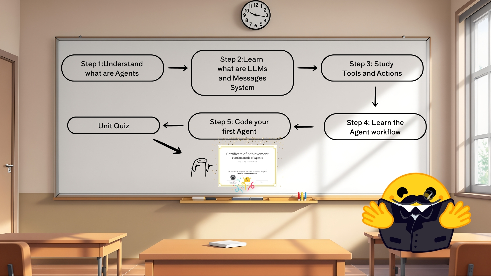
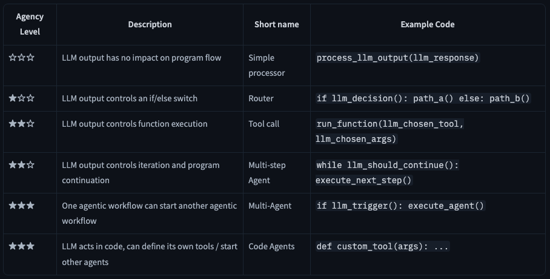
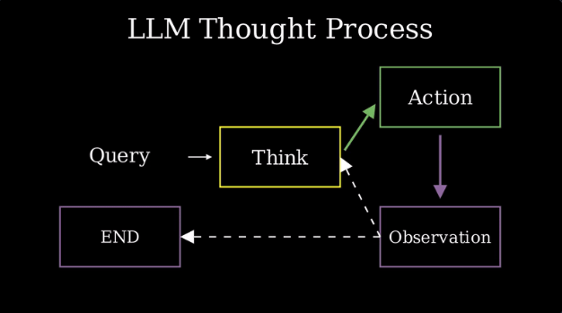
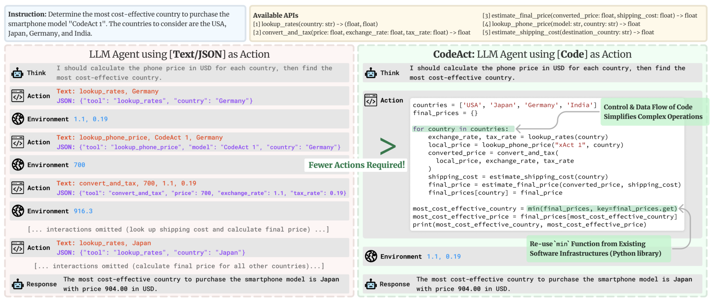
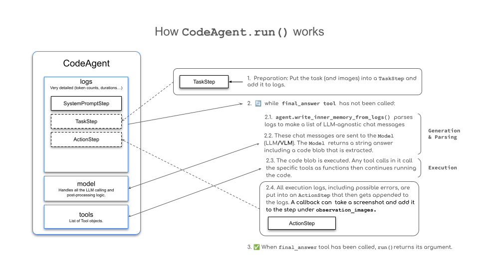
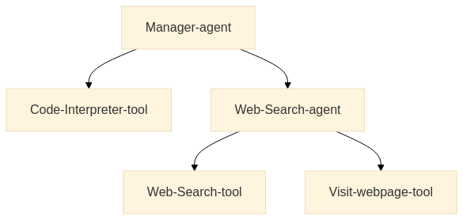
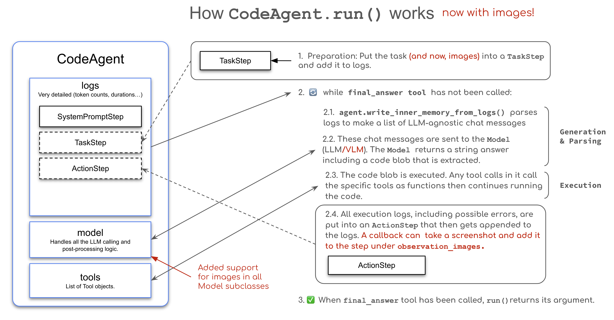

# Learning LLM Agents



## WHAT IS AN AGENT?

_Agent_ - is an AI model capable of reasoning, planning, and interacting with its environment. More officially:
> "An Agent is a system that leverages an AI model to interact with its environment in order to achieve a user-defined objective. It combines reasoning, planning, and the execution of actions (often via external tools) to fulfill tasks."

_Agency_ - the ability to interact with the environment.

_Brain (AI Model)_ - this is where all the thinking happens. The AI model handles reasoning and planning. Decides on actions to take. 

_Body (Capabilities and Tools)_ - this is everything the agent is equipped to do.

Agency levels:



The most common AI model found in agents is an LLM, which takes Text as an input and outputs Text as well.

## WHAT ARE LLMs?

_LLMs_ are the most common type of _AI models_ for Agents.

There are encoders (text -> embedding), decoders (text -> next token), seq2seq or encoder-decoder (text -> embedding -> another text).

The underline principle: **its objective is to predict the next token, given a sequence of previous tokens**. 

Each model has its own end-of-sequence (EOS) token.


## MESSAGES AND SPECIAL TOKENS

- there are special message tokens that are added to the input
- system message - is the first message the LLM sees, and it instructs it how to behave
- each model has its own conversation tokens style

An example:
```python
messages = [
    {"role": "system", "content": "You are an AI assistant with access to various tools."},
    {"role": "user", "content": "Hi !"},
    {"role": "assistant", "content": "Hi human, what can help you with ?"},
]
from transformers import AutoTokenizer

tokenizer = AutoTokenizer.from_pretrained("HuggingFaceTB/SmolLM2-1.7B-Instruct")
rendered_prompt = tokenizer.apply_chat_template(messages, tokenize=False, add_generation_prompt=True)
```


## WHAT ARE TOOLS?

A Tool is a function given to the LLM. This funciton should fulfill a clear objective.

A tool should contain:
- A textual description of what the function does 
- A _Callable_ with typings
- _Arguments_ with typings
- (Optional) Outputs with typings

For example, instead of retrieving the weather data itself, the LLM will generate text that reoresents a tool call, such as call weather_tool('Paris').

We describe all the tools an agent can use inside the system prompt.

**Model Context Protocol (MCP)** is an open protocol that standardizes how applications _provide tools to LLMs_. 
MCP provides:
- A growing list of pre-built integrations that your LLM can directly plug into
- The flexibility to switch between LLM providers and vendors
- Best practice for securing your data within your infrastructure

Any framework implementing MPC can leverage tools defined within the protocol.

## AGENT WORKFLOW: Thought-Action-Observation Cycle



The agent can go through the cycle again and again until reaching the solution. This principle is a part of a core concept _ReAct cycle_.

In the thought step, the agent breaks down the task to a set of sub-problems.

In the action step, it executes the tools via structured prompts. Or generates code to solve the task (Code agents).

In the observation step, the agent processes the output of actions. An important idea here is that this process works in loops, so that the agent has a chance to reiterate if needed.

## CREATE YOUR FIRST AGENT

```python
import os
from huggingface_hub import InferenceClient
from dotenv import load_dotenv
load_dotenv()

model_name = "microsoft/phi-3-mini-4k-instruct"
client = InferenceClient(model_name)
#%%
output = client.text_generation(
    "The capitals of France were",
    max_new_tokens=100,
)
print(output)
#%%
output = client.chat.completions.create(
    messages=[
        {"role": "user", "content": "The capitals of France were"},
    ],
    stream=False,
    max_tokens=1024,
)
print(output.choices[0].message.content)
#%%
output = client.chat.completions.create(
    messages=[
        {"role": "user", "content": "The capital of Israel is"},
    ],
    stream=False,
    max_tokens=1024,
)
print(output.choices[0].message.content)
#%%
# This system prompt is a bit more complex and actually contains the function description already appended.
# Here we suppose that the textual description of the tools has already been appended.

SYSTEM_PROMPT = """Answer the following questions as best you can. You have access to the following tools:

get_weather: Get the current weather in a given location

The way you use the tools is by specifying a json blob.
Specifically, this json should have an `action` key (with the name of the tool to use) and an `action_input` key (with the input to the tool going here).

The only values that should be in the "action" field are:
get_weather: Get the current weather in a given location, args: {"location": {"type": "string"}}
example use :

{{
  "action": "get_weather",
  "action_input": {"location": "New York"}
}}


ALWAYS use the following format:

Question: the input question you must answer
Thought: you should always think about one action to take. Only one action at a time in this format:
Action:

$JSON_BLOB (inside markdown cell)

Observation: the result of the action. This Observation is unique, complete, and the source of truth.
... (this Thought/Action/Observation can repeat N times, you should take several steps when needed. The $JSON_BLOB must be formatted as markdown and only use a SINGLE action at a time.)

You must always end your output with the following format:

Thought: I now know the final answer
Final Answer: the final answer to the original input question

Now begin! Reminder to ALWAYS use the exact characters `Final Answer:` when you provide a definitive answer. """
#%%
messages=[
    {"role": "system", "content": SYSTEM_PROMPT},
    {"role": "user", "content": "What's the weather in London ?"},
    ]
from transformers import AutoTokenizer
tokenizer = AutoTokenizer.from_pretrained(model_name)

tokenizer.apply_chat_template(messages, tokenize=False,add_generation_prompt=True)
#%%
prompt = tokenizer.apply_chat_template(messages, tokenize=False,add_generation_prompt=True)
output = client.text_generation(
    prompt,
    max_new_tokens=200,
)

print(output)
#%%
output = client.text_generation(
    prompt,
    max_new_tokens=200,
    stop=["Observation:"] # Let's stop before any actual function is called
)

print(output)
#%%
# Dummy function
def get_weather(location):
    return f"the weather in {location} is sunny with low temperatures. \n"

get_weather('London')
#%%
new_prompt = prompt + output + get_weather('London')
final_output = client.text_generation(
    new_prompt,
    max_new_tokens=200,
)

print(final_output)
```

Tedious, yea? Let's learn smolagents and see how this (and other) framework helps us to save some time with technical code for agents.

## CREATE AN AGENT WITH `smolagents`

`smolagents` is a library that focuses on _codeAgent_, a kind of agent that performs "Actions" through code blocks, and then "Observes" results by executing the code.

- [Create an Agent with `smolagents`](https://huggingface.co/learn/agents-course/en/unit1/tutorial)
- [My first agent in 🤗Spaces](https://huggingface.co/spaces/ArseniyPerchik/First_agent_template)


## SMOLAGENTS FRAMEWORK

When to use:
- lightweight minimal solution
- experiment quickly
- application logic is straightforward

Code vs. JSON actions: unlike other frameworks that use JSON actions, `smolagents` focuses on tool calls in code. No need to parse the JSON to build code that calls tools: the output can be executed directly.



Code agents are the default type in `smolagents`.

Why code agent and not JSON agent:
- composability: easily combine are reuse actions
- object management: work directly with complex structures like images
- generality: express any computationally possible task
- natural for LLMs: high-quality code is already present in LLM training data
 
How code agents work:



> The code did not run in my case. Unfortunately, no API-free code is available to run the agents. I need to buy a PRO subscription.
> Ok, now I have a pro subscription. Let's continue.

The simplest code to run:

```python
from smolagents import CodeAgent, DuckDuckGoSearchTool, HfApiModel
agent = CodeAgent(tools=[DuckDuckGoSearchTool()], model=HfApiModel())
agent.run("Search for the best music recommendations for a party at the Wayne's mansion.")
```

A simple tool use:

```python
from smolagents import CodeAgent, tool, HfApiModel

# Tool to suggest a menu based on the occasion
@tool
def suggest_menu(occasion: str) -> str:
    """
    Suggests a menu based on the occasion.
    Args:
        occasion (str): The type of occasion for the party. Allowed values are:
                        - "casual": Menu for casual party.
                        - "formal": Menu for formal party.
                        - "superhero": Menu for superhero party.
                        - "custom": Custom menu.
    """
    if occasion == "casual":
        return "Pizza, snacks, and drinks."
    elif occasion == "formal":
        return "3-course dinner with wine and dessert."
    elif occasion == "superhero":
        return "Buffet with high-energy and healthy food."
    else:
        return "Custom menu for the butler."

# Alfred, the butler, preparing the menu for the party
agent = CodeAgent(tools=[suggest_menu], model=HfApiModel())

# Preparing the menu for the party
agent.run("Prepare a formal menu for the party.")
```

You can use even some default python modules:

```python
from smolagents import CodeAgent, HfApiModel
import numpy as np
import time
import datetime

agent = CodeAgent(tools=[], model=HfApiModel(), additional_authorized_imports=['datetime'])

agent.run(
    """
    Alfred needs to prepare for the party. Here are the tasks:
    1. Prepare the drinks - 30 minutes
    2. Decorate the mansion - 60 minutes
    3. Set up the menu - 45 minutes
    4. Prepare the music and playlist - 45 minutes

    If we start right now, at what time will the party be ready?
    """
)
```

To push the agent:

```python
# Change to your username and repo name
agent.push_to_hub('sergiopaniego/AlfredAgent')
```

To load the agent:
```python
# Change to your username and repo name
alfred_agent = agent.from_hub('sergiopaniego/AlfredAgent', trust_remote_code=True)
alfred_agent.run("Give me the best playlist for a party at Wayne's mansion. The party idea is a 'villain masquerade' theme")  
```

Example of ToolCallingAgent that uses JSON calls instead of generating code:

```python
from smolagents import ToolCallingAgent, DuckDuckGoSearchTool, HfApiModel
agent = ToolCallingAgent(tools=[DuckDuckGoSearchTool()], model=HfApiModel())
agent.run("Search for the best music recommendations for a party at the Wayne's mansion.")
```

Creation of a tool by a `Tool` class:

```python
from smolagents import Tool, CodeAgent, HfApiModel

class SuperheroPartyThemeTool(Tool):
    name = "superhero_party_theme_generator"
    description = """
    This tool suggests creative superhero-themed party ideas based on a category.
    It returns a unique party theme idea."""

    inputs = {
        "category": {
            "type": "string",
            "description": "The type of superhero party (e.g., 'classic heroes', 'villain masquerade', 'futuristic Gotham').",
        }
    }

    output_type = "string"

    def forward(self, category: str):
        themes = {
            "classic heroes": "Justice League Gala: Guests come dressed as their favorite DC heroes with themed cocktails like 'The Kryptonite Punch'.",
            "villain masquerade": "Gotham Rogues' Ball: A mysterious masquerade where guests dress as classic Batman villains.",
            "futuristic Gotham": "Neo-Gotham Night: A cyberpunk-style party inspired by Batman Beyond, with neon decorations and futuristic gadgets."
        }

        return themes.get(category.lower(), "Themed party idea not found. Try 'classic heroes', 'villain masquerade', or 'futuristic Gotham'.")

# Instantiate the tool
party_theme_tool = SuperheroPartyThemeTool()
agent = CodeAgent(tools=[party_theme_tool], model=HfApiModel())

# Run the agent to generate a party theme idea
result = agent.run(
    "What would be a good superhero party idea for a 'villain masquerade' theme?"
)

print(result)  # Output: "Gotham Rogues' Ball: A mysterious masquerade where guests dress as classic Batman villains."
```

There are also some [default tools](https://huggingface.co/docs/smolagents/reference/tools#default-tools).

You can share and import tools.

You can import tools from LangChain and MCP servers.

### RAG - Retrival Augmented Generation

**Retrival Augmented Generation (RAG)** systems combine the capabilities of data retrieval and generation models to provide context-aware responses. For example, the results of a web search are pasted into the context window, so that the model can process the results as well to build its next tokens.


**Agentic RAG** extends traditional RAG systems by combining autonomous agents with dynamic knowledge retrival. It allows the agent to autonomously formulate search queries, critique retrieved results, and conduct multiple retrieval steps for a more tailored and comprehensive output.

### Multi-Agent Systems

Many agents can collaborate on complex tasks.

An example:



### Vision Agents

It is possible to use images in the pipeline of `smolagents`.



## LLAMAINDEX FRAMEWORK

**LlamaIndex** - is a framework to create LLM-powered agents.
The key parts of LlamaIndex are:
- **Components**: Components are the basic building blocks you use in LlamaIndex. These include things like _prompts_, _models_, and _databases_. Components often help connect LlamaIndex with other tools and libraries.
- **Tolls**: Tools are components that provide specific capabilities like searching, calculating, or accessing external services. They are the building blocks that enable agents to perform tasks.
- **Agents**: Agents are autonomous components that can use tools and make decisions. They coordinate tool usage to achieve complex tasks.
- **Workflows**: Are step-by-step processes that process logic together. Workflows or agentic workflows are a way to structure agents behavior without the explicit use of agents.

The advantages of LlamaIndex:
- Clear workflow system
- Advanced Document parsing with LamaParse (paid feature)
- Many ready-to-use components
- LlamaHub

## LANGGRAPH FRAMEWORK

## USE CASE FOR AGENTIC RAG

## FINAL PROJECT

## BONUS 1

## BONUS 2

## BONUS 3


## Credits

- [🤗Agents Course](https://huggingface.co/learn/agents-course/unit0/introduction)